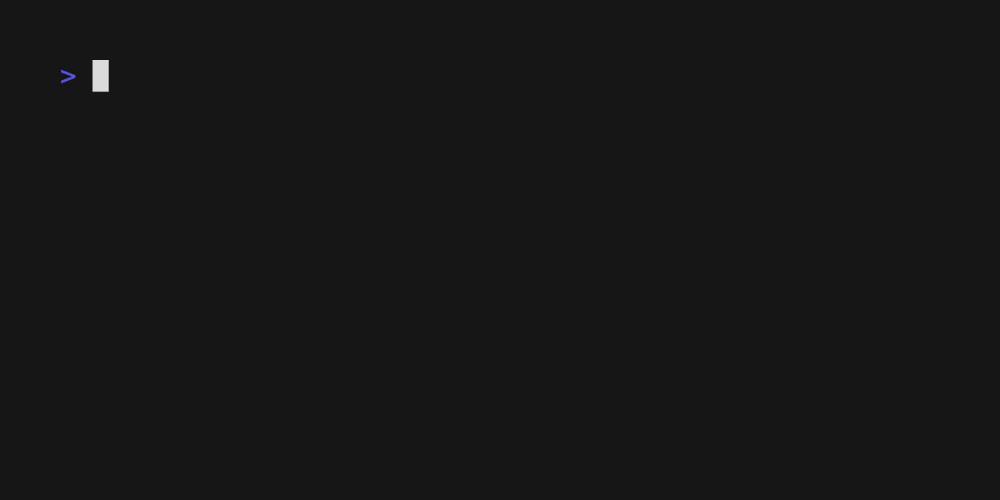

# UniCourse CLI

This is the command line tool for UniCourse.

If you are looking for the client library, see [unicourse](https://www.npmjs.com/package/unicourse).



## Installation

```sh
pnpm i -g @unicourse-tw/cli
```

> Feel free to use `npm` / `yarn` if you prefer.

## Usage

```sh
unicourse --help
```
